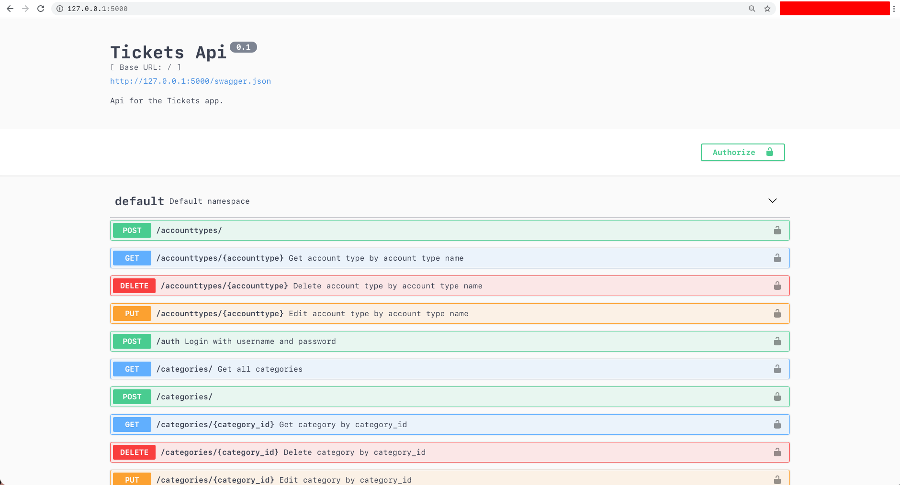

# Contributing

## Setup
### backend
#### database
1. install sqlite, sqlitebrowser/sql server
2. create a database file (not needed for linux)
- e.g. `"C:\Users\<username>\Desktop\tickettracker.db"`
3. **copy `template.config.py` to `config.py`**
4. in `config.py` change the database URI to your path
- e.g. `r"sqlite:///C:\Users\<username>\Desktop\tickettracker.db"`
5. run `python db_filler.py`
6. open your database file in sqlitebrowser/sql server to check data is filled

#### server
1. install python 3.9
```sh
sudo pacman -S python
```
2. install python packages (pip/conda/pacman)
```sh
pip install python-flask python-flask-bcrypt python-flask-cors python-flask-dotenv python-flask-jwt python-flask-jwt-extended python-flask-marshmallow python-flask-migrate python-flask-restx python-flask-sqlalchemy python-marshmallow-sqlalchemy
```
3. run `python tester.py` to check if modules are installed properly
4. run `python app.py`
5. go to your browser and type `127.0.0.1:5000`, you should see this:


### frontend

### mobile
1. install npm
```sh
sudo pacman -S npm
```
2. install yarn, expo-cli
```sh
npm install -g yarn expo-cli
```
3. copy `template.config.js` to `config.js` and edit server ip to your ip
4. download "expo go" application to your mobile device
5. run `python app.py` in the `backend` directory
6. `expo start` in the `mobile` directory
7. scan the qr code with your mobile device
