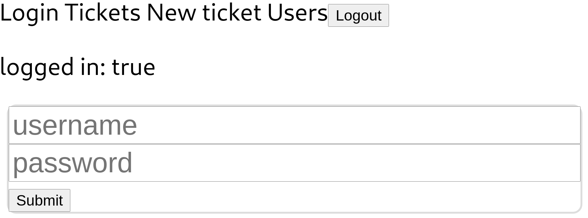
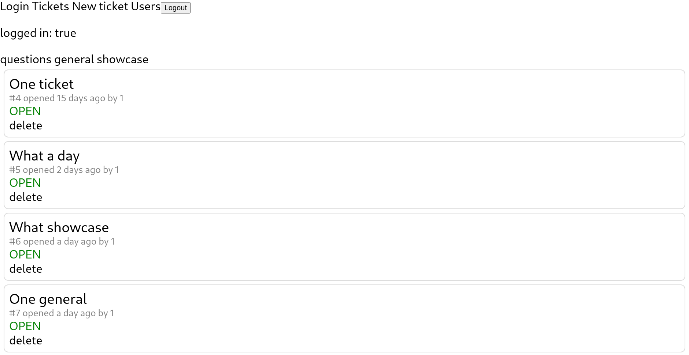

# ticket-tracker
let's build a bug tracker!

## current state
refer to the roadmap file, the frontend state can be seen below!

login with JWT tokens:

show tickets within a chosen category:

create a ticket with a given category:

