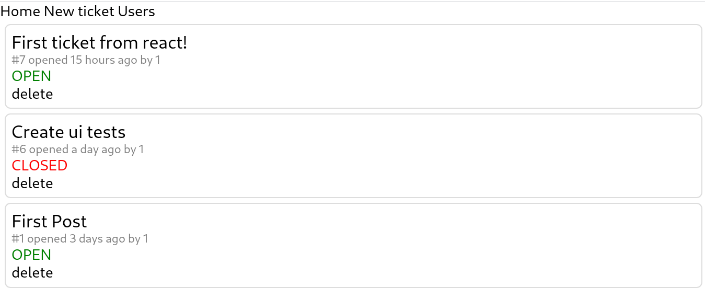

# ticket-tracker
let's build a bug tracker, because why not

## current state

## sprint 1 --- 16 to 23 Dec 2020
satisfy the minimal requirements so we can use the ticket tracker to build it

refer to the roadmap file
