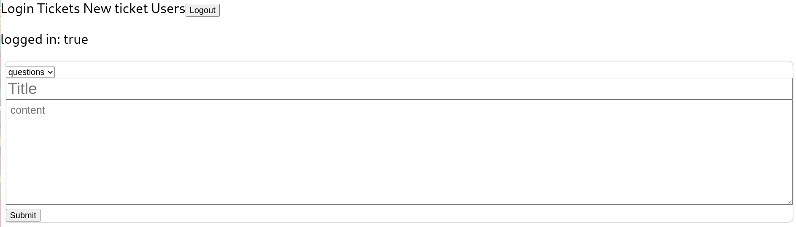
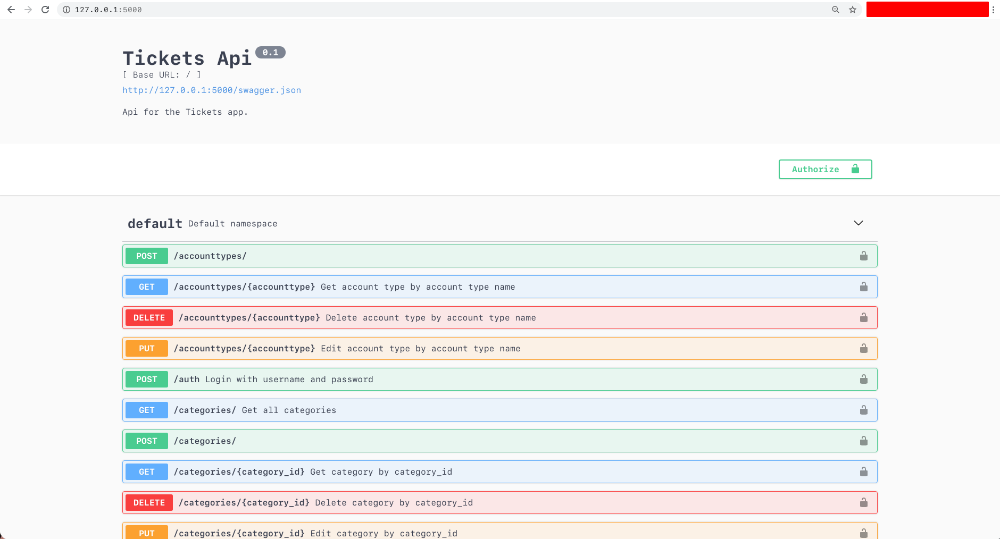

# ticket-tracker
For development informations refer to the `roadmap.md` file in raw format!
Contributing information can be found in `CONTRIBUTING.md`

# current state
## mobile

## frontend
show tickets within a chosen category

create a ticket with a given category

## backend
swagger api

classes

